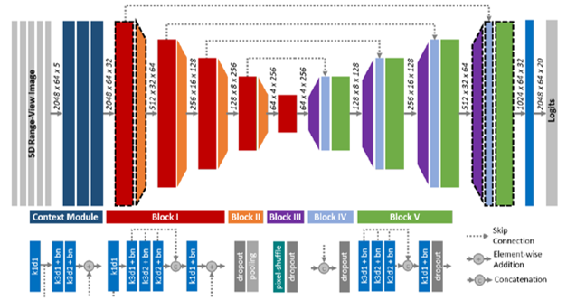

# LiDAR Semantic Segmentation using SalsaNext and RangeViT



## Project Overview

Understanding the surrounding environment is a fundamental requirement for autonomous driving systems. Semantic segmentation enables vehicles to classify every point in a LiDAR scan into meaningful object categories such as roads, buildings, vegetation, pedestrians, and vehicles.

This project investigates semantic segmentation of 3D LiDAR point clouds using two state-of-the-art deep learning architectures: **SalsaNext**, a convolutional neural network designed for range-image-based LiDAR perception, and **RangeViT**, a Vision Transformer framework for semantic understanding of LiDAR scenes.

The work was conducted as part of the M.Sc. Geoinformatics Project Seminar at Leibniz University Hannover and focuses on adapting pretrained models to real-world Ouster LiDAR data through transfer learning and domain adaptation techniques.

---

## Problem Statement

Most state-of-the-art LiDAR perception models are trained on benchmark datasets such as SemanticKITTI. However, real-world deployment often involves different sensors, acquisition environments, and data distributions that can significantly reduce model performance.

This project investigates how pretrained semantic segmentation models can be adapted to a custom Ouster LiDAR dataset while maintaining strong generalization capabilities.

Key challenges include:

* Cross-sensor domain shift
* Limited labeled training data
* Dataset format incompatibilities
* Generalization to unseen environments
* Transfer of learned semantic representations

---

## Technical Workflow

### 1. Dataset Preparation

Raw Ouster LiDAR measurements were converted into SemanticKITTI-compatible format to enable training and inference using existing semantic segmentation frameworks.

### 2. Range Image Generation

3D point clouds were projected into 2D range-image representations, preserving geometric and intensity information required for deep learning-based perception.

### 3. Data Annotation

Point cloud data were manually annotated to generate semantic labels for supervised training and evaluation.

### 4. Transfer Learning

Pretrained SalsaNext and RangeViT models were adapted to the custom dataset through fine-tuning strategies.

### 5. Model Evaluation

Performance was evaluated using qualitative and quantitative analyses of semantic segmentation predictions across different scenes and object categories.

### 6. Domain Adaptation Analysis

Experiments were conducted to investigate the impact of sensor differences and domain shift between SemanticKITTI and custom Ouster LiDAR data.

---

## Key Contributions

* Developed a complete LiDAR semantic segmentation pipeline for custom Ouster datasets
* Implemented SemanticKITTI-compatible dataset conversion workflows
* Generated range-image representations from raw point clouds
* Performed manual semantic annotation of LiDAR scenes
* Adapted pretrained SalsaNext and RangeViT models using transfer learning
* Investigated domain adaptation challenges for cross-sensor generalization
* Compared CNN-based and Vision Transformer-based perception architectures
* Evaluated semantic segmentation performance for autonomous driving applications

---

## Technologies and Frameworks

* Python
* PyTorch
* Deep Learning
* Computer Vision
* LiDAR Perception
* SemanticKITTI
* SalsaNext
* RangeViT
* Transfer Learning
* Domain Adaptation
* Point Cloud Processing

---

## Results

The experiments demonstrate the feasibility of adapting pretrained semantic segmentation models to custom LiDAR datasets through transfer learning. The project highlights both the strengths and limitations of CNN-based and Vision Transformer-based architectures when applied to real-world sensor data.

The repository contains implementation notebooks, dataset conversion utilities, visualizations, technical documentation, and project reports.

---

## Applications

* Autonomous Driving
* Intelligent Transportation Systems
* Robotics
* Smart Cities
* Environmental Mapping
* Digital Twins
* Geospatial Intelligence
* 3D Scene Understanding

---

## Repository Structure

```text
code/
├── dataset_conversion/
└── utility_scripts/

docs/
└── Final Project Report

presentations/
└── Project Seminar Presentation

images/
└── Segmentation Results and Visualizations

results/
└── Model Predictions and Evaluation Outputs
```

---

## Author

**Muhammad Jawad**

M.Sc. Geoinformatics

Leibniz University Hannover

Research Interests:

* Machine Learning
* Deep Learning
* Computer Vision
* LiDAR Perception
* Autonomous Driving
* SLAM
* State Estimation
* Vision-Language Models

